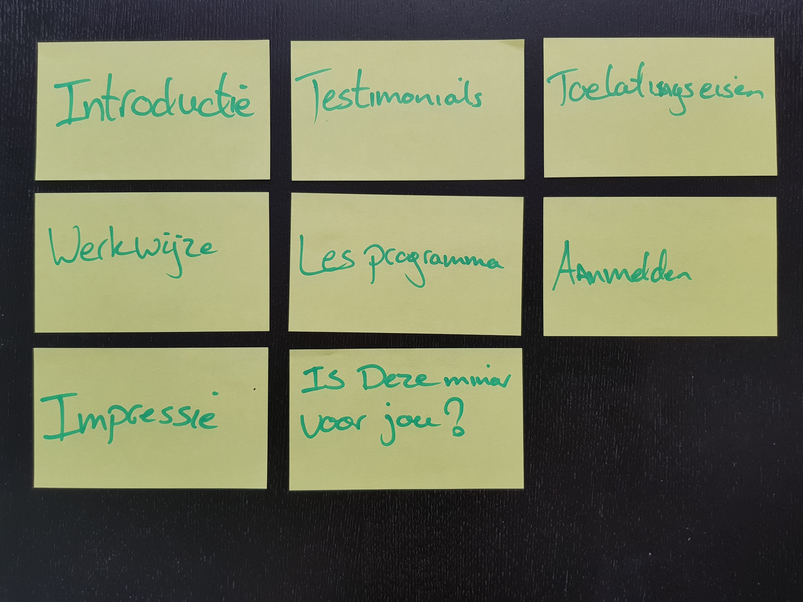
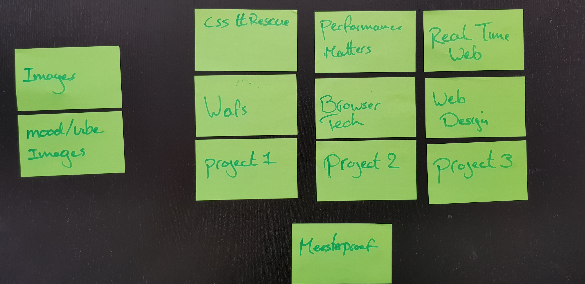
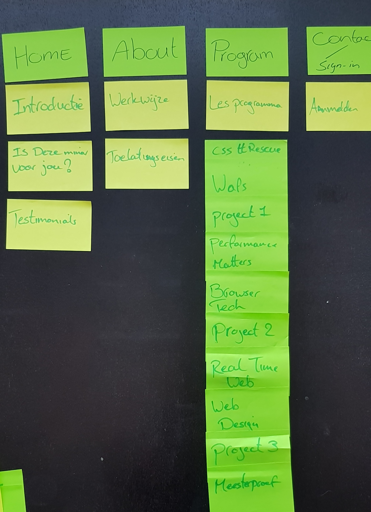
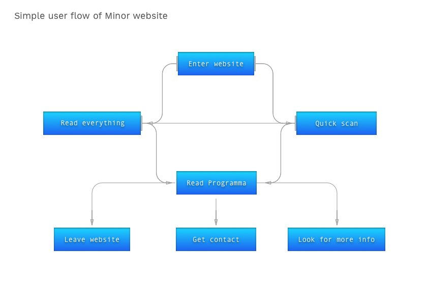
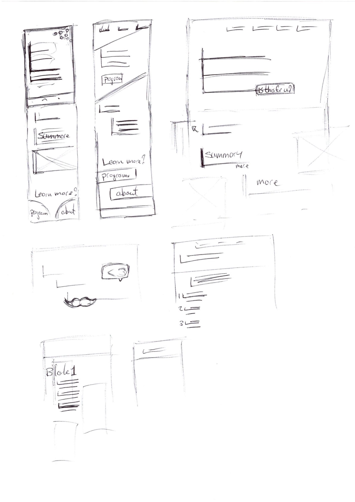
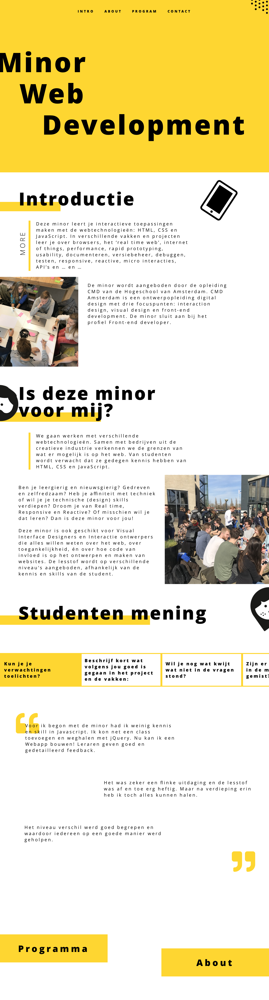
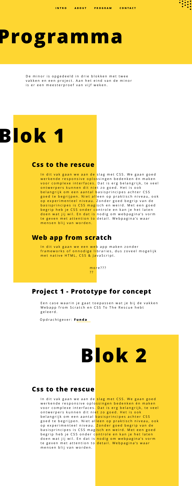
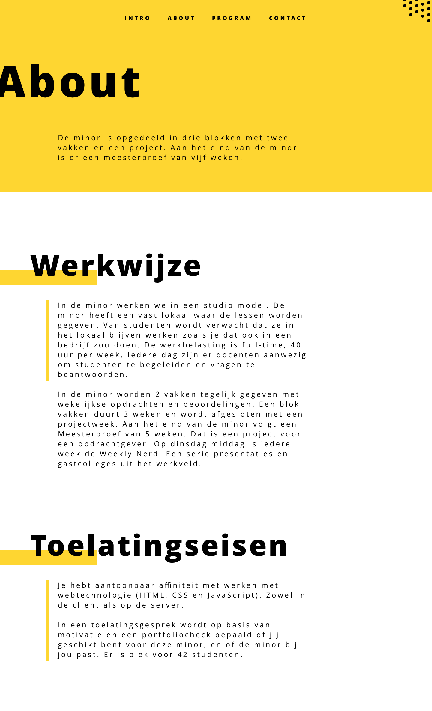

# Minor Everything Web - Website
This repo is for a course from minor Everything Web at HvA. 

The content used for this project comes from the current minor website found [HERE][current] (20-04-2018)

Website live **[HERE](https://kyunwang.github.io/web-design/minor-website/dist)**

*The content is in dutch*

# Table of Content
- [Introduction](#introduction)
- [Getting started](#getting-started)
- [Content](#content)
	- [Sections](#sections)
	- [Contents](#contents)
	- [Sorted](#sorted)
- [User scenario](#user-scenario)
	- [Marie](#marie)
	- [Potential minor student](#potential-minor-student)
- [User interview](#user-interview)
	- [Bas](#bas)
- [Userflow](#userflow)
- [Design](#design)
	- [Sketches](#sketches)
	- [Digital](#digital)
	- [Principles](#principles)
- [User test](#user-test)
	- [Marie](#marie)
		- [Result](#result)
- [To do](#to-do)

# Introduction
In this project for the minor the principle of *Exclusive design* has to be applied. This will be done by *focusing/constraining* myself by designing for a specific user(s).
This project will be a redesign with the goal of implementing *Exclusive design* and *the principles of user interface design* [Article](article)

<!-- Principle of http://bokardo.com/principles-of-user-interface-design/ too? -->
<!-- Principles of ai too? e.g. browsing behaviour and sort/filtering -->

# Getting started
*This project uses yarn*

Here is how to get started with this project
1. Download or clone the repo `git clone https://github.com/kyunwang/web-design.git`
2. Run `cd minor-website`
3. Run `yarn`
4. Do `yarn dev`
5. Go to [localhost:3000](localhost:3000) and you are ready to go.

# Content
The current website is a one page static website divided in eight sections with a few images.

This is the content the current website offers and what we will be working with:

## Sections
The current website is divided eight sections.

- introductie
- impressie
- is deze minor voor jou?
- werkwijze
- lesprogramma
- toelatingseisen
- aanmelden
- testimonials

## Contents
The content is divided per section and is in:
- Text
- Few images
- Text behind a toggle (I count this as a type content)

The cards on the right are the items under the section *lesprogramma* which has ten toggle items.

## Sorted
This is how the content will be sorted across scenes/states/pages.

# User scenario
The user scenario will clarify the goal and tasks. There are two user scenarios for this project:

## Marie
From the case:
>Marie is a graphic designer. She is Deaf, with capital D. This means that her first language is Dutch Sign Language. Quite a few of the hurdles she faces have to do with the fact that spoken/written Dutch is not her first language.

This means that that the difference between the Dutch Sign Language and Dutch can be a barrier for understanding.

<!-- **Scenario:** Marie want to learn about the Minor and without too much hassle. She doesn't want to get stuck with jargon. -->

**Scenario:** Marie has a friend who is looking for a minor and wants her help with his/her search. For her friend she wants to get a clear view of what this minor is all about and form an opinion about it.

**Goal:** Deliver clear and consice content for Marie(and other Deaf) to show what this minor is all about.

## Potential minor student
**The potential student is a Software Engineer student called Bas**

As software engineer student, Bas learns all about the back-end but not front-end.
He might be interested in the minor Everything web to learn more about front-end to complement his skills.

**Scenario:** Bas is looking for a minor and stumbles across Minor Everything Web during his search. He wants to learn about the minor to be certain that this is what he is looking for. He wants to know what the subjects given will benefit him and knowing about the experience of other students wouldn't hurt either. 

**Goal:** Showcase the minor with content to instill a curiosity for the potential student. The student needs to be able to contact someone or sign in.

# User interview

## Bas
Bas had been searching for a minor to following with a friend of his. They have chosen this minor (Everything web) because they wanted to learn Front-end technology. As Software Engineer students they only learned about the Back-end.

Bas had the opinion that learning Front-end development would increase his worth as developer. Especially because he would be able to create something from start to finish.

Information about the minor was found on *[Kiesopmaat][kiesopmaat]*, from the poster made by the minor and the [minor website][current] at the time.

They almost did not join the minor because of the look of the website. Given them the though "Is this web design?". They did join the minor after reconsidering the course content.

Their school has recommended them to sign up throught the website of [kiesopmaat][kiesopmaat]

Notes:
- Signing up for the minor will not go throught the website
- The course content e.g. programme is the most important for the potential student
- The initial impression is important e.g. the look
- Web development should go hand in hand with web design

# Userflow

A simplefied userflow of someone looking for an minor would go through.

# Design

## Sketches
*A few sketches will be placed here*
	

## Digital
This is the design made for the minor website, this time with a *desktop first* approach instead of *mobile first*. The goal was to make the content clear and seperate them to induce one primary action per state (block);

*Note: This is a 'take away' design to follow and there exists some testing in it e.g. the wat the header is presented*

*Design is a subject to change in development (Which did happen in some cases*
	
**Introduction**

**Programma (Curriculum)**

**About**

**Introduction mobile**

## Principles
The following principle from this article has been implemented and where/how.

6. One primary action per screen
More accurate is to say *one primary action per state/scene* as a screen acan be divided in sections of focus. 

8. Provide a natural next step
At the end of the 'Intro' a next step will be provided about where to go next. (the (programma)curriculum or over(about) page)

11. Strong visual hierarchies work best
Great importance have been given to the headers/titles of each block to allow the visitor to quickly scan the page.

12. Smart organization reduces cognitive load
This principle is a by-product of principle 11. The separating of content in own block is how this is implemented.

# User test

## Marie
Marie has said that Deaf people have a hard time with complex words/sentences and jargon. That said being *To-the-point* was really important.

Sadly. I did not have the time to rewrite the content to make it easier to digest. However, it seemed that showing only the minimum required information and giving the option to read more was really pleasant and made the content easier to digest.

There was one *assignment* given to Marie to test the site, which was: *To see whether this minor(web development) might be something for a friend of her who is looking for a minor.*

### Result
The results that came out of the test:
- It was easy to scan through the site
- It was not clear that the questions in the testimonials were clickable
- The hierarchy in the testimonials was not clear. (The link between selecting a question and getting the answers)
- The *Meer* and *Minder* button/toggle was not clear until later
- The separation of content in blocks made the content easy to digest

As Marie is pretty comfortable with multiple sign languages and reads frequently (sign language and the national language are not the same) she 

# To do
The to do list for when I have the time to fix it or if someone wants to make a PR *winkwink*
- [x] Fix the transitions on the intro page
- [x] Make the testimonials section responsive
- [ ] Process the feedback from the test (See [usertest](#user-test))
- [x] Create the Contact page - (The submit will not be working)

[current]: https://cmda.github.io/minor-everything-web/

[article]: http://bokardo.com/principles-of-user-interface-design/
[kiesopmaat]: https://www.kiesopmaat.nl/
